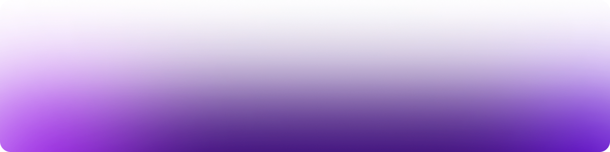

<!-- https://user-images.githubusercontent.com/14703164/205845922-6ae7b151-b59d-453e-8a4a-359f1d7b7dcb.mp4 -->

<!-- https://devilmaycry.fandom.com/wiki/Bury_the_Light -->
<!-- https://piped.video/watch?v=FMj4kj3oSc0 -->

<!-- > Pure bliss 😌 -->
<!-- https://user-images.githubusercontent.com/14703164/139421447-5cfb25ba-c527-4b7c-bed3-65a29cc1b313.mp4 -->
<!-- https://piped.video/watch?v=L7hVbB6L6bs  -->

<a href="https://kimchiii.space">
  <picture>
    <source media="(prefers-color-scheme: dark)" srcset=".github/assets/dark.png" />
    <source media="(prefers-color-scheme: light)" srcset=".github/assets/dark.png" />
    
  </picture>
</a>

<!-- ##### Extras -->

###### Use Raycast?

###### Use VS Code?

